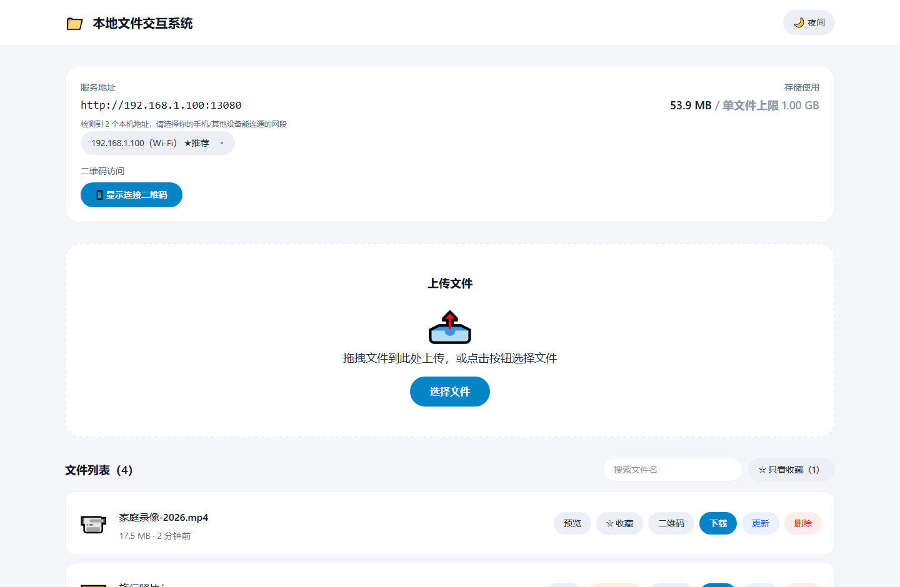
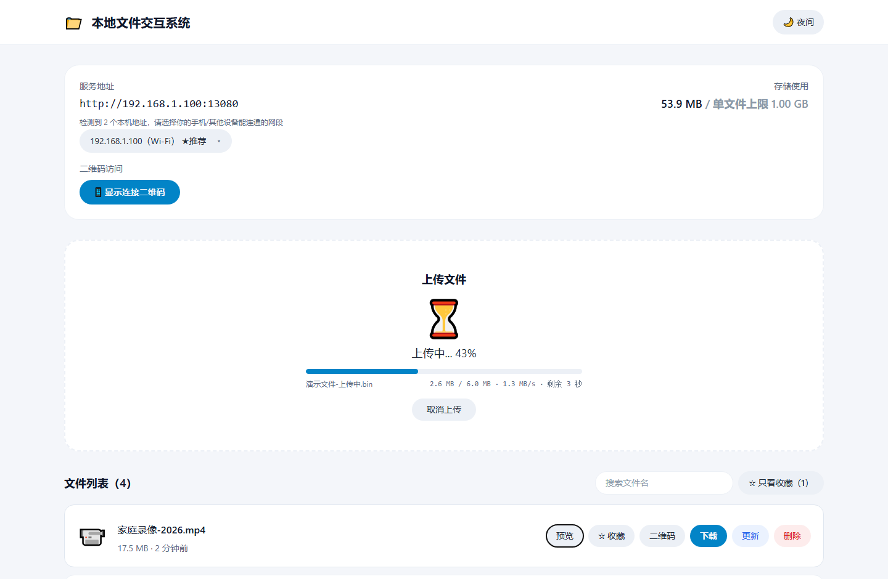
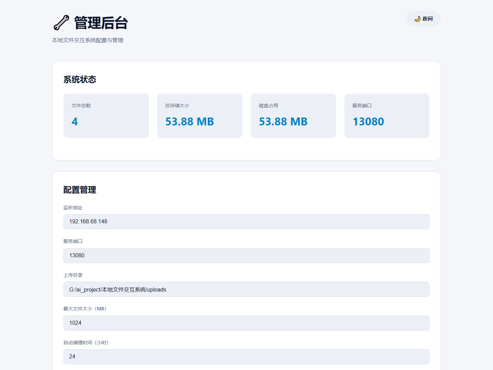
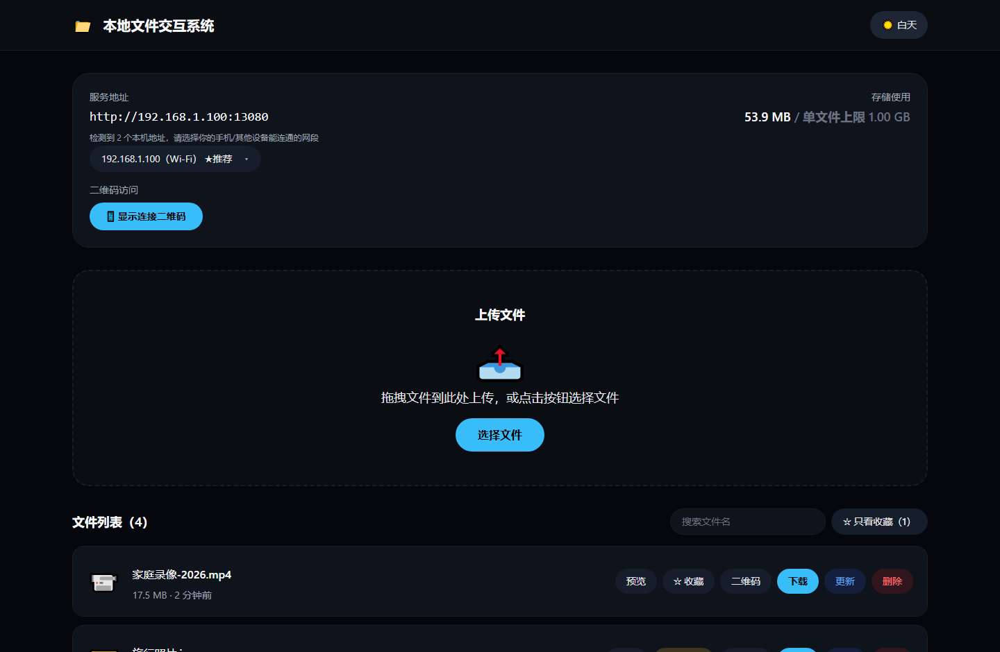

# 本地文件交互系统 (LAN File Share)

> ⚠️ **本项目面向局域网，无登录、无鉴权**
>
> 同一网络内任何设备打开地址即可查看、下载、删除文件。请只在可信网络（家庭 / 办公室内网）使用，**不要暴露到公网**。


> 文件默认**24 小时自动过期清理**；需要长期保存请点「☆ 收藏」，收藏的文件豁免清理。

> 作者：**你们喜爱的老王** · B 站 @你们喜爱的老王 · GitHub [@ops120](https://github.com/ops120)

把手机、平板、电脑之间的文件互传简化成「扫码即用」：在局域网内起一个服务，其他设备扫码或输入地址打开页面，即可上传、下载、在线预览。全部流量都在本地局域网内，不经过任何云端。

## 功能特性

- 📤 **文件上传**：多选 / 拖拽上传，实时显示进度条、**速度**与剩余时间，可随时取消
- 📥 **文件下载**：支持 HTTP Range 断点续传；中文文件名保真（RFC 5987 编码）
- 🎬 **在线预览**：视频 / 图片 / 音频 / PDF 直接在页面上查看，视频可拖进度、全屏（内联流式 + Range）
- 📱 **扫码即用**：连接二维码 + 单文件二维码，扫码进入下载落地页
- 🔍 **搜索与收藏**：按文件名实时过滤，可与「只看收藏」叠加
- 📂 **目录直投**：把文件直接拷进 `uploads/`，几秒内自动出现在列表里
- 🔧 **管理后台**：状态、配置、批量删除与过期清理（仅监听 127.0.0.1，局域网不可访问）
- ⚡ **实时同步**：WebSocket 广播，多设备列表自动刷新
- 🎨 **白天 / 夜间主题**：默认白天，右上角一键切换，选择会记住
- 📦 **可打包成单文件 exe / 发布包**：`npm run build:exe` 免安装可执行文件，`npm run release` 出 zip + 校验和（Node SEA）
- 🔒 **本地优先**：局域网内传输，零云端依赖，无任何外发请求

## 环境要求

- Node.js 18+（实测 v24.13）
- Windows 10+ / macOS 10.15+ / Linux
- 浏览器：Chrome 90+、Edge 90+、Safari 14+、Firefox
- 所有设备在同一局域网（同一 WiFi；需关闭路由器的「AP 隔离」）

## 界面预览

主界面（服务地址选择 / 上传 / 搜索 / 收藏 / 文件列表）：



上传中显示进度、实时速度与剩余时间，可取消：



视频在线预览（原生播放器，可拖动进度、全屏）：


管理后台（仅本机可访问）：



右上角可切换夜间主题（选择会记住）：



> 截图为演示用的脱敏数据（见 `demo/` 目录）。

## 一键启动

1. 双击 `启动.bat`（Windows），或执行 `bash 启动.sh`（macOS / Linux）
   - 脚本会自动检查并安装依赖、**构建前端**（`client/dist` 不进版本库，缺少时先构建），然后启动服务
2. 控制台会列出本机**所有**可访问地址，挑一个你的设备能连通的：
   ```
   🚀 本地文件交互系统已启动
   📡 监听端口: 13080（所有网卡）
   📡 可用访问地址（本机有多个网卡，请挑一个手机/其他设备能连通的网段）:
      1. http://192.168.1.100:13080    [Wi-Fi]  ← 默认用于二维码
      2. http://10.0.0.5:13080    [以太网]
   📡 本机地址: http://localhost:13080
   🔧 管理后台: http://localhost:13081
   ```
3. 电脑浏览器打开任一地址；手机扫「显示连接二维码」，或在页面「服务地址」处切到手机能连通的网段后再扫码

### 默认端口

| 端口 | 用途 |
|---|---|
| **13080** | 主服务（前端页面 + REST API + WebSocket） |
| **13081** | 管理后台（仅监听 `127.0.0.1`，固定为 `port + 1`） |
| **3000** | 前端 Vite dev（仅 `npm run dev` 时使用） |

### 自定义端口

编辑 `config.json`：

```json
{
  "host": "0.0.0.0",
  "port": 13080,
  "uploadDir": "G:/ai_project/本地文件交互系统/uploads",
  "maxFileSize": 1073741824,
  "autoCleanHours": 24
}
```

- `host` 写成 `0.0.0.0` 时自动探测本机局域网地址，并在页面上提供多网卡选择
- 管理后台端口固定为 `port + 1`；改完需**重启服务**
- dev 模式的代理目标会自动跟随 `config.json` 的端口，无需另外配置

## 打包成 exe（免安装分发）

```bash
npm run build:exe        # 产物：dist-exe/本地文件交互系统/
```

生成的分发目录里有：

```
本地文件交互系统/
├── 本地文件交互系统.exe     # 单文件可执行程序（约 91 MB，内含 Node 运行时 + 网页资源）
├── config.json             # 端口等配置（可改，改完重启）
└── 使用说明.txt            # 给最终用户看的说明
```

### 生成发布包（zip + 校验和）

```bash
npm run release
```

产物在 `release/`：

| 文件 | 说明 |
|---|---|
| `本地文件交互系统-v<版本>-win-x64.zip` | 可直接分发的发布包（约 34 MB，含 exe、config.json、使用说明、LICENSE、NOTICE） |
| `SHA256SUMS.txt` | 发布包的 SHA-256 校验和，便于对方核对完整性 |

`release` 会先执行 `build:exe` 再压缩，一条命令出包。包内附带 LICENSE 与 NOTICE —— Apache-2.0 第 4 条要求再分发时随包提供许可证与声明。

实现方式：Node SEA（Single Executable Application）+ esbuild 打包 + postject 注入。
前端页面、管理后台页面与 sql.js 的 wasm 都编译进 exe，首次启动时解到同级 `.runtime/` 目录；
数据（`uploads/` 与 `data/`）放在 exe 所在目录，配置文件里 `uploadDir` 写相对路径时
相对的是 exe 目录而不是工作目录，因此从任何位置启动都不会写错地方。

**验证 exe**（真实浏览器跑一遍关键流程，含视频解码播放）：

```bash
# 先双击 exe（或命令行启动它），然后：
node scripts/verify-exe.mjs                       # 默认 http://localhost:13080
node scripts/verify-exe.mjs http://localhost:13180 # 也可指到别处的实例
```

说明：
- exe 未做数字签名，首次运行 Windows 可能提示"未知发布者"，选择"仍要运行"即可
- 若放在 `C:\Program Files` 等不可写目录，数据目录会自动回退到 `%USERPROFILE%\LANFileShare`

## 手动启动

```bash
npm install      # 安装依赖（npm workspaces：server + client）
npm run build    # 构建前端 → client/dist
npm start        # 启动服务（同时拉起 13081 管理后台）

# 开发模式：前端热更新（Vite 3000），/api 与 WebSocket 自动代理到后端
npm run dev
```

## 目录结构

### 项目结构

```
.
├── server/                  # 后端服务
│   ├── server.js            # 主服务：静态托管 + REST API + WebSocket
│   ├── admin-server.js      # 管理后台（127.0.0.1:port+1，经主服务 API 读写数据）
│   ├── admin.js             # 废弃的历史实现（未被引用，仅存档）
│   └── resumable-upload.js  # 断点续传设计初稿片段（未被引用，正式实现在 server.js）
├── client/                  # 前端（React + Vite + Tailwind）
│   ├── src/
│   │   ├── App.jsx          # 页面：上传 / 列表 / 搜索 / 收藏 / 预览 / 二维码弹窗
│   │   ├── store.js         # zustand 状态与 API 调用
│   │   └── index.css
│   └── vite.config.js       # dev 代理（端口跟随 config.json，已开启 ws）
├── admin/index.html         # 管理后台页面
├── tests/                   # Playwright 测试（16 个 spec 文件）
│   ├── api-contract.spec.js     # 接口契约（预览 / 直投 / 搜索 / 多网卡 / 中断回收）
│   ├── browser-acceptance.mjs   # 独立真实浏览器验收脚本（44 项断言 + 截图）
│   └── global-teardown.js       # 收尾清理测试产生的文件
├── demo/                    # README 用的界面截图
├── .github/workflows/       # CI（Playwright E2E）
├── LICENSE / NOTICE         # Apache-2.0 许可证与署名/第三方声明
├── config.json              # 端口 / 上传目录 / 单文件上限 / 过期时长
├── playwright.config.js     # 7 个浏览器与设备项目
├── 启动.bat / 启动.sh        # 一键启动脚本
├── scripts/                 # 构建与验证脚本
│   ├── build-exe.mjs        #   打包单文件 exe（Node SEA）
│   ├── sea-entry.cjs        #   exe 入口：解出内置资源后启动服务
│   └── verify-exe.mjs       #   用真实浏览器验证 exe
├── .doc/                    # 本地文档（PRD / 用户手册 / 测试说明 / 变更记录 / 验收报告 …）
├── tmp/                     # 临时与生成物（测试报告、截图、日志）
├── dist-exe/                # exe 构建产物（不纳入版本库）
└── release/                 # 发布包 zip 与校验和（不纳入版本库）
```

### 运行时数据目录（不属于仓库）

| 目录 / 文件 | 作用 |
|---|---|
| `uploads/` | 上传的文件本体（路径由 `config.json` 的 `uploadDir` 指定） |
| `uploads/.temp/` | 分块上传的临时分块（超过过期时长自动清理） |
| `data/database.db` | 元数据索引（sql.js 单文件数据库） |
| `data/database.db.bak` | 写入前的备份；启动时若检测到损坏会自动回退 |
| `test_data/` | 测试临时文件与样例视频 |
| `tmp/test-results/`、`tmp/playwright-report/` | 测试产物（报告 / 截图 / trace） |
| `client/dist/` | 前端构建产物 |
| `.doc/` | 本地文档（PRD、用户手册、测试说明、变更记录、复核与验收报告等） |
| `tmp/` | 其他临时文件（启动日志等） |
| `dist-exe/` | exe 构建产物（含运行时的 `.runtime/` 解包目录） |
| `release/` | 发布包 zip 与 SHA-256 校验和 |

以上均已通过 `.gitignore` 排除，**不要**提交到版本库。

## 系统架构

```
┌──────────────────────────────────────────────┐
│  手机 / 平板 / 另一台电脑                      │
│  扫码或输入地址 → 浏览器打开页面                │
└───────────────────┬──────────────────────────┘
                    │ 局域网 HTTP / WebSocket
                    ▼
┌──────────────────────────────────────────────┐
│  Express 主服务  :13080                       │
│  ├─ 静态托管 client/dist（前端页面）           │
│  ├─ REST API（上传 / 下载 / 预览 / 收藏 / 二维码）│
│  ├─ WebSocket 广播（多设备列表实时刷新）        │
│  ├─ 过期清理（每小时；收藏豁免）+ 孤儿文件回收    │
│  ├─ 上传目录直投扫描（列表接口触发，5 秒节流）    │
│  └─ 分块上传 / 断点续传 + 整文件 SHA-256 校验    │
└──────────┬────────────────────────┬───────────┘
           ▼                        ▼
┌──────────────────────┐  ┌────────────────────────┐
│  uploads/  文件本体   │  │  data/database.db      │
│  （含 .temp 分块）    │  │  索引：文件名/大小/收藏  │
└──────────────────────┘  └────────────────────────┘
           ▲
           │ 经主服务 API 读写（不直接操作数据库）
┌──────────┴───────────────────────────────────┐
│  管理后台  Express :13081（仅 127.0.0.1）      │
│  状态 / 配置 / 文件管理 / 触发清理             │
└──────────────────────────────────────────────┘
```

## 验证步骤

1. **检查服务与接口**
   ```bash
   curl http://localhost:13080/api/info
   # → {"ip":"192.168.1.100","port":13080,"url":"...","addresses":[...],"maxFileSize":1073741824,...}
   ```
2. **打开页面**
   - 主页面：http://localhost:13080
   - 管理后台：http://localhost:13081（仅本机）
3. **自动化验收（真实浏览器）**
   ```bash
   npx playwright install chromium                   # 首次需下载浏览器
   node tests/browser-acceptance.mjs                 # 独立验收：48 项断言 + 截图 → tmp/test-results/acceptance/
   npx playwright test --project=chromium-desktop     # 全量回归：225 条用例（报告 → tmp/playwright-report/）
   ```
   说明：验收脚本中的「视频真实播放」断言需要本机有 `ffmpeg`（用于生成 WebM 样例视频 ——
   Playwright 自带的 Chromium 不含 H.264 专有编解码器）；缺少 `ffmpeg` 时该项会明确标记为
   「跳过」并说明原因，不会静默通过。

## API 端点

| 端点 | 方法 | 说明 |
|---|---|---|
| `/api/info` | GET | 服务信息与**全部**本机可访问地址（多网卡选择用） |
| `/api/files` | GET | 文件列表（同时触发上传目录扫描） |
| `/api/upload` | POST | 上传文件（multipart 字段名 `files`，单次最多 50 个） |
| `/api/files/{id}` | PUT | 重新上传替换（multipart 字段名 `file`） |
| `/api/files/{id}` | DELETE | 删除（未知 id 返回 404；重复删除幂等） |
| `/api/files/{id}/favorite` | POST / DELETE | 收藏 / 取消收藏（POST 可带 `{favorite:bool}` 显式指定） |
| `/api/download/{id}` | GET | 下载（`attachment`，支持 Range 断点续传） |
| `/api/preview/{id}` | GET | 在线预览（`inline` + `nosniff`，支持 Range 拖动进度） |
| `/api/qrcode/{id}` | GET | 单文件二维码（可带 `?host=` 指定本机地址） |
| `/api/connect-qrcode` | GET | 连接二维码（可带 `?host=`） |
| `/download/{id}` | GET | 扫码落地页（手机打开后点「立即下载」） |
| `/api/upload/status/{filename}` | GET | 断点续传：查询已上传分块 |
| `/api/upload/chunk` | POST | 断点续传：上传分块（可带 `fileHash` 做整文件 SHA-256 校验） |
| `/api/admin/cleanup` | POST | 手动触发过期清理（仅本机） |

管理后台（:13081，仅本机可访问）：

| 端点 | 方法 | 说明 |
|---|---|---|
| `/api/admin/status` | GET | 文件总数 / 总大小 / 磁盘占用 / 服务端口 |
| `/api/admin/config` | GET / POST | 查看 / 修改 `config.json`（需重启生效） |
| `/api/admin/files` | GET | 文件列表（数组） |
| `/api/admin/files/delete-batch` | POST | 批量删除（`{fileIds:[...]}`） |
| `/api/admin/cleanup` | POST | 清理过期文件（转发给主服务执行） |

## 安全

- **无鉴权（设计取舍）**：局域网内任何设备都能查看与删除文件，这是「扫码即用、零配置」的代价；
  请勿暴露到公网，也建议只在家庭 / 办公室内网使用。
- **管理后台仅本机**：只监听 `127.0.0.1`，且非 GET 请求校验 `Origin`（挡跨站表单 CSRF）。
- **CORS 收敛**：仅放行本机与私有网段来源，避免局域网内任意网页跨源读取文件列表或触发删除。
- **路径穿越防护**：分块 / 状态接口的文件名必须是纯文件名，含 `/`、`\`、`..` 一律 400。
- **输出转义**：下载落地页与管理后台的文件名均做 HTML 转义；预览与下载响应带
  `X-Content-Type-Options: nosniff`，避免上传的「伪装文本」被当 HTML 执行。
- **零外发**：除局域网内请求外无任何 outbound 连接（mDNS 广播也只在本网段）。

## 性能预算

| 项 | 备注 |
|---|---|
| 启动 → 首屏 | 本地回环实测 < 1 秒（静态资源 + 列表接口） |
| 上传（局域网） | 受 WiFi / 网线带宽限制；页面上有实时速度与剩余时间 |
| 下载 / 预览 | Range 流式；40MB 视频实测秒开、可拖动进度（未做精细计时） |
| 列表渲染 | 50 个文件的批量上传用例通过；文件很多时建议用搜索过滤（列表暂无分页） |

## 约束

- Node.js `>=18`（见 `package.json` 的 `engines`，实测 v24.13）。
- 单文件上限 **1GB**、单次最多 **50** 个文件（`maxFileSize` 可在管理后台调整）。
- 默认端口 **13080（主服务）/ 13081（管理后台）**；改端口请编辑 `config.json` 后重启。
- 文件默认 **24 小时过期**（`autoCleanHours`），收藏的文件豁免清理；过期判定与临时分块清理每小时执行一次。
- 手机扫码打不开时：确认同一 WiFi、关闭路由器「AP 隔离」，并在页面「服务地址」处选择手机能连通的网段。
- 文件列表**暂无分页**；前端为整文件上传（后端分块续传接口与 SHA-256 校验已就绪但 UI 未接入）。
- 版本历史、PRD、用户手册、测试说明与复核验收记录都在 `.doc/` 目录（该目录与 `tmp/` 均不纳入版本库）。

## 许可证

本项目基于 [Apache License 2.0](LICENSE) 开源。

可以自由使用、修改、商用与分发，但 **Apache-2.0 第 4 条要求保留署名**：

- 分发时须附带 [`LICENSE`](LICENSE) 副本与 [`NOTICE`](NOTICE) 文件内容
- 修改过源文件时，须注明「已修改」，不能把改动当成原作者的版本
- 不得移除或篡改版权、专利、商标与归属声明
- 本项目明确授予专利许可（第 3 条）；若对本项目发起专利诉讼，该授权自动终止

一句话：拿去用没问题，但不能抹掉作者信息。

## 作者

**你们喜爱的老王**

- B 站：@你们喜爱的老王
- GitHub：[@ops120](https://github.com/ops120)

项目做出来是给自己家里/办公室用的，顺手开源出来。有问题或建议欢迎到 [Issues](https://github.com/ops120) 提，
或者在 B 站留言。

## 社区

本项目在 [LINUX DO](https://linux.do/) 社区进行开源推广，感谢社区佬友的交流、反馈与建议。

## 致谢 / 第三方组件

- 后端：[Express](https://github.com/expressjs/express)、[sql.js](https://github.com/sql-js/sql.js)、[ws](https://github.com/websockets/ws)、[multer](https://github.com/expressjs/multer)、[qrcode](https://github.com/soldair/node-qrcode)、[bonjour-service](https://github.com/onlxltd/bonjour-service)
- 前端：[React](https://github.com/facebook/react)、[Vite](https://github.com/vitejs/vite)、[Tailwind CSS](https://github.com/tailwindlabs/tailwindcss)、[zustand](https://github.com/pmndrs/zustand)、[qrcode.react](https://github.com/zpao/qrcode.react)
- 测试：[Playwright](https://github.com/microsoft/playwright)
- 以及所有开源依赖的作者。
